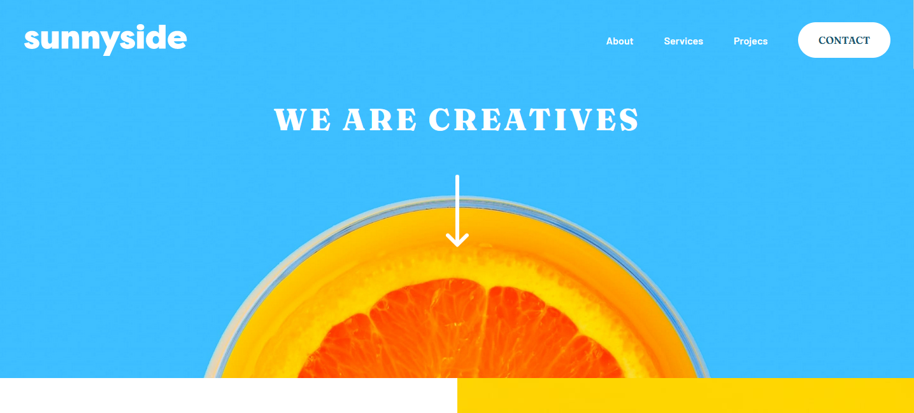

<h1 align="center"> Frontend Mentor - Sunnyside agency landing page </h1>

    
    
    
    

Creation of a landing page following the inscructions from [FrontendMentor](https://www.frontendmentor.io/challenges/sunnyside-agency-landing-page-7yVs3B6ef).

